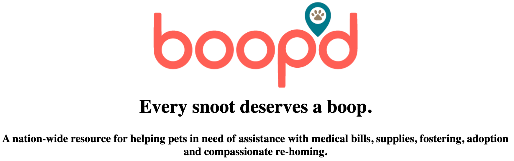
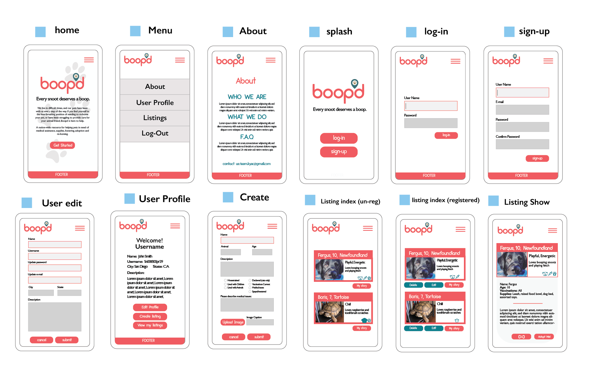
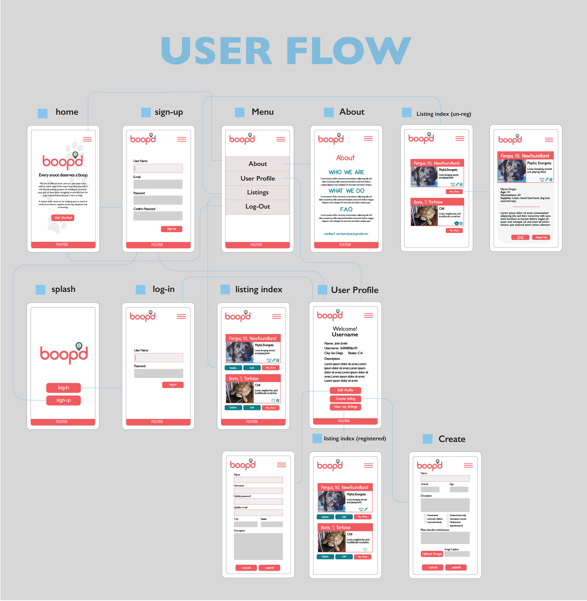
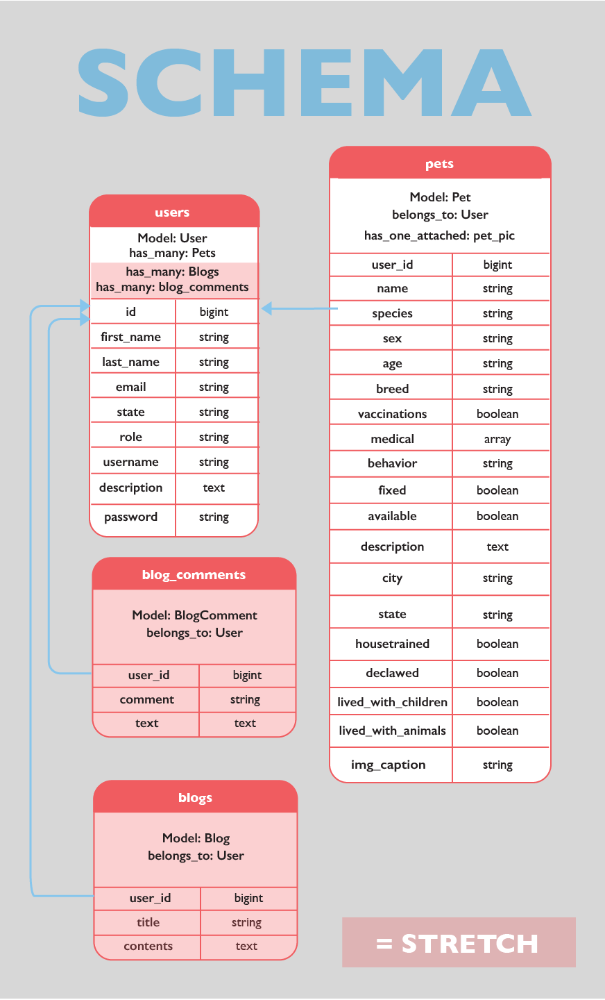

  

*We* at **KYAC** Inc. have seen an increase of de-homed animals and struggling families during the pandemic. It is our vision to be part of the solution. 

*With* our pet-adoption-resource boopd, we connect struggling animals with benevolent humans who wish to care for them in these trying times. 

*We* present to you a nation-wide resource to find the animal that belongs in your home, or find the home that is worthy of your beloved pet that you can no longer care for.

<h1 align="center">Running the App</h1>
<table align="center">
  <tr>
    <th>Live Version</th>
    <th>From the Repo</th>
  </tr>
  <tr>
    <td rowspan="9"><a href="https://floating-mesa-77996.herokuapp.com/">Live Version</a></td>
    <td>1.  Clone and install
     $ git clone https://github.com/team-kyac/boopd.git
     $ cd boopd
     $ bundle
     $ yarn
     $ rails db:create
     $ rails db:migrate
    </td>
  </tr>
  <tr>

  </tr>
  <tr>
    <td> 2. Run the server locally
     $ rails s
    </td>
  </tr>
</table>
 
### >Dependencies
- Ruby on Rails 6.1.4
- yarn 1.21.1
    
### >Reporting a Vulnerability
To report a vulnerability please send an email with the details to [Email](team.kyac@gmail.com). This will help us to assess the risk and start the necessary steps. Thanks for helping to keep **boopd** secure.

### >Want to contribute to boopd?
Check out our [CONTRIBUTING.md]() to get started with setting up the repo.
- Check out the issues with the [good first issue]() and [help wanted]() label. We suggest also looking at the closed ones to get a sense of the kinds of issues you can tackle.
- Our discussions/notes/roadmap: [boopd_notes.md]()
- If you have already joined Slack, join our #kyac channel and say Hi!:smiley:

<h1 align="center">App Features </h1>

More details please check [here](https://spark.adobe.com/page/uDyY6hGN9zU6O/) 

**boopd** is a full-stack web application created by the team **KYAC** as a student capstone project at LEARN Academy. 

Acting as a development team, the students use agile and scrum project management techniques to plan, wireframe, code, and deploy an application.

### Project Requirements
- [x] React in Rails application
    - [x] As a developer, I need to add react to the Rails application and add Webpacker to compile JavaScript.
    - [x] As a developer, I need to create a full-stack application by adding a React component using a generate command. 
    - [x] As a developer, I have a pages directory for my JavaScript views.
    - [x] As a developer, I have a components folder within my components folder to hold reusable react modules.
    - [x] As a developer, I have a router for my front-end pages.
- [x] User authentication (register, login, logout)
    - [x] As a developer, I can use Devise to generate user model and controllers for my application.
    - [x] As a developer, I need test the user sign-up, sign-in, and sign-out functions to make sure the user model works.
    - [x] As a developer, I can add state, role, first name, last name, and description to my devise user model.
- [x] Minimum of two database tables (one will be User)
    - [x] As a developer, I can create a model for pets that belongs to user, and has the appropriate attributes defined in our schema mockup.
    - [x] As a developer, I have a create method using controller.
    - [x] As a developer, I have a index method using controller.
    - [x] As a developer, I have a show method using controller.
    - [x] As a developer, I have a edit method using controller.
    - [x] As a developer, I have a destroy method using controller.
    - [x] As a developer, I have appropriate request spec for index/show/edit/destroy method.
    - [x] As a developer, I have validations in place to ensure that all of my model attributes are present except vaccinations and medical.
- [ ] Minimum of one external API
    - [ What we use ](https://developer.spotify.com/documentation/web-api/)
- [ ] Testing - 60% code coverage
    - [x] As a developer, I can create a test to cover my animal controller.
      - [x] As a developer, I have a create method to pass the test.
      - [x] As a developer, I have a index method to pass the test.
      - [x] As a developer, I have a show method to pass the test.
      - [x] As a developer, I have a edit method to pass the test.
      - [x] As a developer, I have a destroy method to pass the test.
    - [x] As a developer, I can create tests to cover my main components/pages.
      - [x] As a developer, I have a PetShow page to pass the test.
      - [x] As a developer, I have a PetNew page to pass the test.
      - [ ] As a developer, I have a PetEdit page to pass the test.
      - [ ] As a developer, I have a Index page to pass the test.
      - [ ] As a developer, I have a Header page to pass the test.

- [ ] Deployed to Heroku
- [x] A well written README (with link to live application)
- [x] Team name
- [x] "About Us" page
    - [x] As a developer, I have a AboutUs page including Project/Team information.

### Project Stretch Goals
- [ ] Responsive Design (include a phone view for example)
- [ ] Accessible design features
- [ ] Continuous Integration

### User Story 
- [x] Sign-up Page
    - [x] As a user, I can navigate to sign-up page and create a account.
    - [x] As a user, I can enter my user email and user password.
    - [x] As a user, I can add state, role, first name, and last name, and username to my user account.
    - [x] As a user, after signing up, I will be redirect to home page.
- [x] Sign-in Page
    - [x] As a user, I can see a form to input my user name and password to sign in.
    - [x] As a user, I can see a button to click after input.
    - [x] As a user, upon successfully sign in, I can be redirect to the home page.
- [x] Landing Page
    - [x] As a user, I can navigate to a landing page.
    - [x] As a user, on the home page I can view the header with navigation.
    - [x] As a user, on the home page I  can navigate to other pages, login, logout and sign up.
    - [x] As a user, on the home page I can view the logo and description for the app.
    - [x] As a user, on the home page I can view the footer.
    - [x] [STRETCH]As a user, on the home page I can see an animation of the logo on page load.
    - [x] [STRETCH] As a user, I can see a different logo on mobile than desktop.
- [x] About Us Page
    - [x] As a user, I can read "Who we are" and "What we do" for more information about this web app.
    - [x] As a user, I can get contact information from About Us page.
    - [x] As a user, I can see a frequent Q&A in About Us page.
    - [x] As a user, I can see a form link to email or message system to communicate.
- [x] Header
    - [x] As a user, I can see a fixed navigation bar on the top of page, so I can navigate to different pages.
    - [x] As a user, I will see the App logo.
    - [x] As a user, I can click the Home navigation button to go back to home page.
    - [x] As a user, I can click the sign-out button to logout.
    - [x] As a user, I can click the register navigation button to see a sign-up form.
    - [x] As a mobile user, I will see a hamburger icon that will toggle the navigation menu and close.
    - [x] As a mobile user, I will see the same button as Desktop user in the hamburger navigation bar.
- [x] Footer
    - [x] As a user, I will see a footer at all pages.
    - [x] As a user, I will see the copyright at the page footer.
    - [x] As a user, I can navigate to Terms&Conditions page from the page footer.
    - [x] As a user, I can navigate to About Us page from the page footer.
- [x] Pet New Page
    - [x] As a registered user, I can see a form and a button to submit the form to create a new pet.
- [x] Pet Index Page
    - [x] As a un-registered user, I am able to see all listed pets.
    - [x] As a un-registered user, I am able to click on an pet to view the details.
    - [x] As a registered user, I can see a button which link to the form to create a pet.
    - [x] As a registered user, I can see a button which link to edit one of my listed pets.
    - [x] As a registered user, I am able to delete my listed pets.
- [x] Pet Show Page
    - [x] As a user, I can see the individual pet with details.
    - [x] As a user, I can see a button that will display additional information about the type of animal I am looking for.
- [x] Pet Edit Page
    - [x] As a logged-in user, if I am the owner of a pet listing, I can see a button on its show page for "Edit".
    - [x] As a logged-in user, I can click this Edit button to go to a form then I can see all the fields for this pet listing with the existing information already filled out.
    - [x] As a logged-in user, I can change the information for any of these fields.
    - [x] As a logged-in user, I can see a "Submit"button that will save my changes.
    - [x] As a logged-in user, after pressing the Submit button I will be redirected back to the Show view for that listing.
- [x] Pet Delete Page
    - [x] As a logged-in user, I can delete a listing which belongs to me.
    - [x] As a logged-in user, I can click a Delete button to delete the listing.
    - [x] As a logged-in user, I will be redirected to the index page after I delete a listing.

    

Stretch Goals
- [x] User Profile
- [x] User Blog
- [x] User Terms& Conditions
- [x] Search Bar

### Wireframe

### User Flow

### Database Schema

<h1 align="center">Meet Team KYAC</h1>

> Kelen Yafuso - Tech Lead

> Yan Xu - Project Manager

> Amanda Ferguson - Design Lead

> Chris Luna - Product Manager

📫Please feel free to contact us at [team.kyac@gmail.com](team.kyac@gmail.com)

